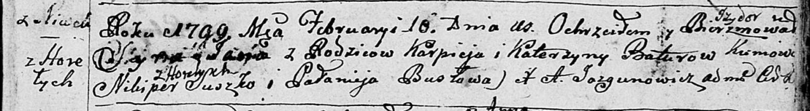

**Сушко Сымон Никиперов (Suszko Symon)**

14 февраля 1787 г -- крещение (НИАБ 136-13-894, лист 1, №3/1787-р
(ориг), (РГИА 832-2-18, лист 233, №4/1787-р (коп)

**НИАБ 136-13-894:** Лист 1. **Метрическая запись №3/1787-р (ориг).**

{width="6.496527777777778in"
height="1.208921697287839in"}

Дедиловичская Покровская церковь. \[14 февраля\] 1787 года. Метрическая
запись о крещении.

Suszko \[Symon\] -- сын родителей с деревни \[Горелое\].

Suszko Nikipier -- отец.

Suszkowa Anna -- мать.

Suszkowa \[Ary\]na - кума.

Jazgunowicz Antoniusz -- ксёндз.

**РГИА 823-2-18:** Лист 233. **Метрическая запись №4/1787-р (коп).**

{width="6.496527777777778in"
height="1.6222222222222222in"}

Дедиловичская Покровская церковь. 14 февраля 1787 года. Метрическая
запись о крещении.

Suszko Symon -- сын родителей с деревни Горелое.

Suszko Nikiper -- отец.

Suszkowa Anna -- мать.

Suszko Wasil -- кум.

Suszkowa Aryna - кума.

Jazgunowicz Antoni -- ксёндз.
