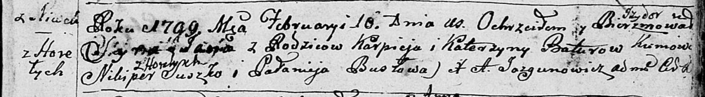

**Сушко Хведор Никиперов (Suszko Chwiedor)**

6 апреля 1796 г -- крещение (НИАБ 136-13-894, лист 29, №43/1796-р
(ориг)), (РГИА 823-2-18, лист 255об, №20/1796-р (коп)).

Лист 29. **Метрическая запись №43/1796-р (ориг).**

{width="6.496527777777778in"
height="0.8300853018372704in"}

Дедиловичская Покровская церковь. 6 апреля 1796 года. Метрическая запись
о крещении.

Suszko Chwiedor -- сын родителей с деревни Горелое.

Suszko Nikiper -- отец.

Suszkowa Anna -- мать.

Szuszko Wasil - кум.

Suszkowa Ryna - кума.

Jazgunowicz Antoni -- ксёндз.

**РГИА 823-2-18:** Лист 255об. **Метрическая запись №20/1796-р (коп).**

{width="6.496527777777778in"
height="1.2555555555555555in"}

Дедиловичская Покровская церковь. 6 апреля 1796 года. Метрическая запись
о крещении.

Suszko Chwiedor -- сын родителей с деревни Горелое.

Suszko Nikiper -- отец.

Suszkowa Anna -- мать.

Suszko Wasil -- кум.

Suszkowa Jryna -- кума.

Jazgunowicz Antoni -- ксёндз.
