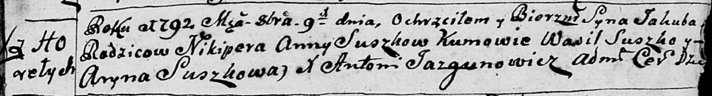
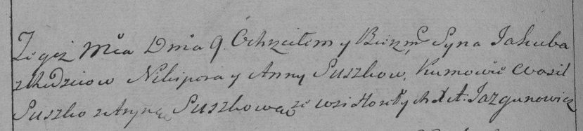

**Сушко Якуб Никиперов (Suszko Jakub)**

9 октября 1792 г -- крещение (НИАБ 136-13-894, лист 17, №62/1792-р
(ориг)), (РГИА 823-2-18, лист 245, №30/1792-р (коп)).

9 апреля 1800 г -- крестный отец Грыгора Рафаля, сына Сушков Миколая и
Натальи с деревни Горелое (НИАБ 136-13-894, лист 41, №13/1800-р (ориг)).

**НИАБ 136-13-894:** Лист 17. **Метрическая запись №62/1792-р (ориг).**

Дедиловичская Покровская церковь. 9 октября 1792 года. Метрическая
запись о крещении.

Suszko Jakub -- сын родителей с деревни Горелое.

Suszko Nikiper -- отец.

Suszkowa Anna -- мать.

Suszko Wasil - кум.

Suszkowa Aryna - кума.

Jazgunowicz Antoni -- ксёндз.

**РГИА 823-2-18:** Лист 245об. **Метрическая запись №30/1792-р (коп).**

Дедиловичская Покровская церковь. 9 октября 1792 года. Метрическая
запись о крещении.

Suszko Jakub -- сын родителей с деревни Горелое.

Suszko Nikiper -- отец.

Suszkowa Anna -- мать.

Suszko Wasil -- кум.

Suszkowa Aryna -- кума.

Jazgunowicz Antoni -- ксёндз.

**НИАБ 136-13-894:** Лист 41. **Метрическая запись №13/1800-р (ориг).**

Дедиловичская Покровская церковь. 9 апреля 1800 года. Метрическая запись
о крещении.

Suszko Grzegorz Rafal -- сын.

Suszko Mikołay -- отец.

Suszkowa Natalla -- мать.

Suszko Jakub -- кум, с деревни Горелое.

Suszkowa Pałanieja -- кума, с деревни Горелое.

Jazgunowicz Antoni -- ксёндз.
