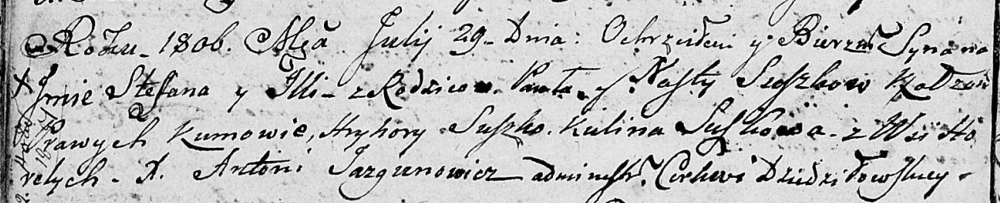
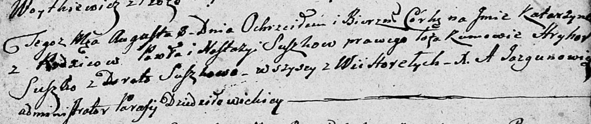
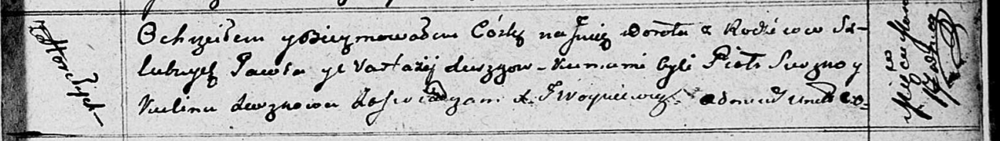

**Сушко Павел (Suszko Paweł)**

29 июля 1806 г -- крещение сына Стефана Ильи (НИАБ 136-13-894, лист
60об, №34/1806-р (об)).

8 августа 1809 г -- крещение дочери Катерыны (НИАБ 136-13-894, лист 75,
№40/1809-р (об)).

14 марта 1812 г -- крещение дочери Дороты (НИАБ 136-13-894, лист 84,
№18/1812-р (об)).

**НИАБ 136-13-894:** Лист 60об. **Метрическая запись №34/1806-р
(ориг).**

Дедиловичская Покровская церковь. 29 июля 1806 года. Метрическая запись
о крещении.

Suszko Stefan Jlla -- сын родителей с деревни Горелое.

Suszko Paweł -- отец.

Suszkowa Nasta -- мать.

Suszko Hryhory -- кум.

Suszkowa Kulina -- кума.

Jazgunowicz Antoni -- ксёндз.

**НИАБ 136-13-894:** Лист 75. **Метрическая запись №40/1809-р (ориг).**

Дедиловичская Покровская церковь. 8 августа 1809 года. Метрическая
запись о крещении .

Suszkowna Katerzyna -- дочь родителей с деревни Горелое.

Suszko Paweł -- отец.

Suszkowa Nastazya -- мать.

Suszko Hryhor -- кум, с деревни Горелое.

Suszkowa Dorota -- кума, с деревни Горелое.

Jazgunowicz Antoni -- ксёндз.

**НИАБ 136-13-894:** Лист 84. **Метрическая запись №18/1812-р (ориг).**

Осовская Покровская церковь. 14 марта 1812 года. Метрическая запись о
крещении.

Suszkowna Dorota -- дочь родителей с деревни Горелое.

Suszko Pawel -- отец.

Suszkowa Nastazyja -- мать.

Suszko Piotr -- кум.

Suszkowa Kulina -- кума.

Woyniewicz Tomasz -- ксёндз.
