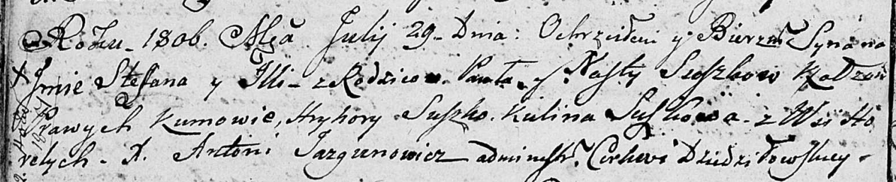

**Сушко Стефан Павлов (Suszko Stefan)**

29 июля 1806 г -- крещение (НИАБ 136-13-894, лист 60об, №34/1806-р
(об)).

**НИАБ 136-13-894:** Лист 60об. **Метрическая запись №34/1806-р
(ориг).**

Дедиловичская Покровская церковь. 29 июля 1806 года. Метрическая запись
о крещении.

Suszko Stefan Jlla -- сын родителей с деревни Горелое.

Suszko Paweł -- отец.

Suszkowa Nasta -- мать.

Suszko Hryhory -- кум.

Suszkowa Kulina -- кума.

Jazgunowicz Antoni -- ксёндз.
