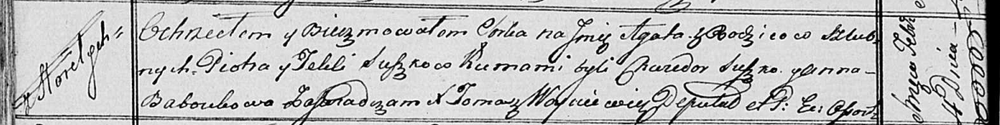

**Сушко Агата Пятрусёва (Suszkowna Agata)**

4 февраля 1817 г -- крещение (НИАБ 136-13-894, лист 95об, №10/1817-р
(ориг)).

**НИАБ 136-13-894:** Лист 95об. **Метрическая запись №10/1817-р
(ориг).**

{width="6.496527777777778in"
height="0.8126531058617673in"}

Осовская Покровская церковь. 4 февраля 1817 года. Метрическая запись о
крещении.

Suszkowna Agata -- дочь родителей с деревни Горелое.

Suszko Piotr -- отец.

Suszkowa Tekla -- мать.

Suszko Chwiedor -- кум.

Baboukowa Anna -- кума.

Woyniewicz Tomasz -- ксёндз.
