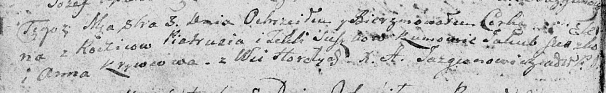

**Сушко Елена Пятрусёва (Suszkowna Elena)**

3 октября 1809 г -- крещение (НИАБ 136-13-894, лист 75об, №50/1809-р
(ориг)).

**НИАБ 136-13-894:** Лист 75об. **Метрическая запись №50/1809-р
(ориг).**

{width="6.496527777777778in"
height="1.0070997375328083in"}

Дедиловичская Покровская церковь. 3 октября 1809 года. Метрическая
запись о крещении.

Suszkowna Elena -- дочь родителей с деревни Горелое.

Suszko Piatruś -- отец.

Suszkowa Tekla -- мать.

Suszko Jakub -- кум.

Krywcowa Anna -- кума.

Jazgunowicz Antoni -- ксёндз.
