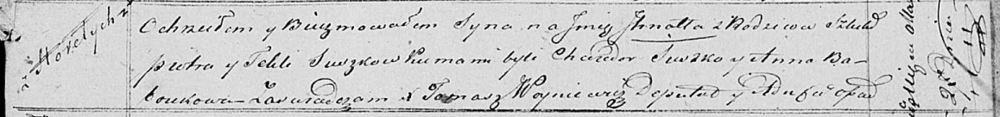

**Сушко Игнат Пятрусёв (Suszko Jhnat)**

27 марта 1821 г -- крещение (НИАБ 136-13-894, лист 106, №17/1821-р
(ориг)).

**НИАБ 136-13-894:** Лист 106. **Метрическая запись №17/1821-р (ориг).**

Осовская Покровская церковь. 27 марта 1821 года. Метрическая запись о
крещении.

Suszko Jhnat -- сын родителей с деревни Горелое.

Suszko Piotr -- отец.

Suszkowa Tekla -- мать.

Suszko Chwiedor -- кум.

Baboukowna Anna -- кума.

Woyniewicz Tomasz -- ксёндз.
