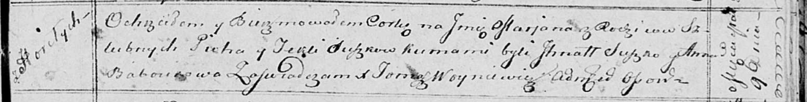

**Сушко Марьяна Пятрусёва (Suszkowna Marjana)**

9 марта 1814 г -- крещение (НИАБ 136-13-894, лист 89, №14/1814-р
(ориг)).

**НИАБ 136-13-894:** Лист 89. **Метрическая запись №14/1814-р (ориг).**

Осовская Покровская церковь. 9 марта 1814 года. Метрическая запись о
крещении.

Suszkowna Marjana -- дочь родителей с деревни Горелое.

Suszko Piotr -- отец.

Suszkowa Tekla -- мать.

Suszko Jhnat -- кум.

Baboukowa Anna -- кума.

Woyniewicz Tomasz -- ксёндз.
