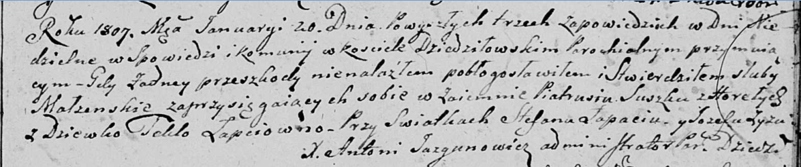
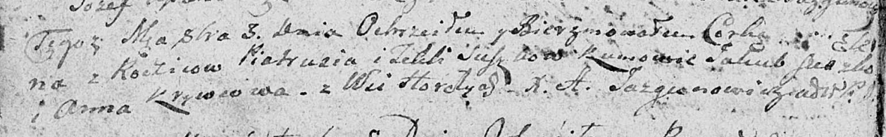
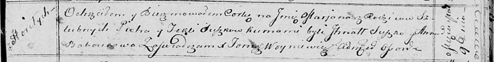
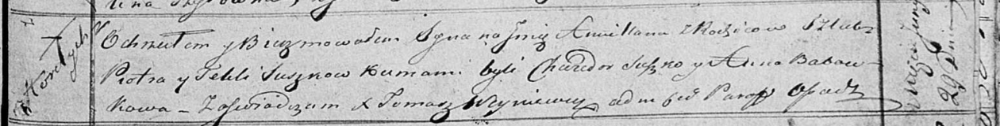
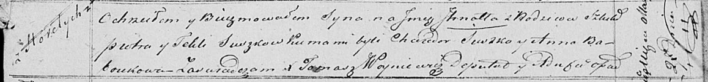

**Сушко (Лапец) Текля (Suszkowa Tekla z Łapciow)**

20 января 1807 г -- венчание с Пятрусём Сушко с деревни Горелое (НИАБ
136-13-920, лист 12, №1/1807-р (ориг)).

3 октября 1809 г -- крещение дочери Елены (НИАБ 136-13-894, лист 75об,
№50/1809-р (ориг)).

10 июля 1811 г -- крещение сына Яна (НИАБ 136-13-894, лист 81об,
№35/1811-р (ориг)).

9 марта 1814 г -- крещение дочери Марьяны (НИАБ 136-13-894, лист 89,
№14/1814-р (ориг)).

4 февраля 1817 г -- крещение дочери Агаты (НИАБ 136-13-894, лист 95об,
№10/1817-р (ориг)).

29 июня 1819 г -- крещение сына Амильяна (НИАБ 136-13-894, лист 101,
№33/1819-р (ориг)).

27 марта 1821 г -- крещение сына Игната (НИАБ 136-13-894, лист 106,
№17/1821-р (ориг)).

**НИАБ 136-13-920:** Лист 12. **Метрическая запись №1/1807-б (ориг).**

Дедиловичская Покровская церковь. 20 января 1807 года. Метрическая
запись о венчании.

Suszko Piatruś -- жених, с деревни Горелое.

Łapcowna Tekła -- невеста, девка.

Łapac Stefan -- свидетель.

Zyz Jozef -- свидетель.

Jazgunowicz Antoni -- ксёндз.

**НИАБ 136-13-894:** Лист 75об. **Метрическая запись №50/1809-р
(ориг).**

Дедиловичская Покровская церковь. 3 октября 1809 года. Метрическая
запись о крещении.

Suszkowna Elena -- дочь родителей с деревни Горелое.

Suszko Piatruś -- отец.

Suszkowa Tekla -- мать.

Suszko Jakub -- кум.

Krywcowa Anna -- кума.

Jazgunowicz Antoni -- ксёндз.

**НИАБ 136-13-894:** Лист 81об. **Метрическая запись №35/1811-р
(ориг).**

Осовская Покровская церковь. 10 июля 1811 года. Метрическая запись о
крещении.

Szuszko Jan -- дочь родителей с деревни Горелое.

Szuszko Piotr -- отец.

Szuszkowa Tekla -- мать.

Szuszko Jakub -- кум.

Krzywcowa Anna -- кума.

Woyniewicz Tomasz -- ксёндз.

**НИАБ 136-13-894:** Лист 89. **Метрическая запись №14/1814-р (ориг).**

Осовская Покровская церковь. 9 марта 1814 года. Метрическая запись о
крещении.

Suszkowna Marjana -- дочь родителей с деревни Горелое.

Suszko Piotr -- отец.

Suszkowa Tekla -- мать.

Suszko Jhnat -- кум.

Baboukowa Anna -- кума.

Woyniewicz Tomasz -- ксёндз.

**НИАБ 136-13-894:** Лист 95об. **Метрическая запись №10/1817-р
(ориг).**

Осовская Покровская церковь. 4 февраля 1817 года. Метрическая запись о
крещении.

Suszkowna Agata -- дочь родителей с деревни Горелое.

Suszko Piotr -- отец.

Suszkowa Tekla -- мать.

Suszko Chwiedor -- кум.

Baboukowa Anna -- кума.

Woyniewicz Tomasz -- ксёндз.

**НИАБ 136-13-894:** Лист 101. **Метрическая запись №33/1819-р (ориг).**

Осовская Покровская церковь. 29 июня 1819 года. Метрическая запись о
крещении.

Suszko Amillan -- сын родителей с деревни Горелое.

Suszko Piotr -- отец.

Suszkowa Tekla -- мать.

Suszko Chwiedor -- кум.

Baboukowa Anna -- кума.

Woyniewicz Tomasz -- ксёндз.

**НИАБ 136-13-894:** Лист 106. **Метрическая запись №17/1821-р (ориг).**

Осовская Покровская церковь. 27 марта 1821 года. Метрическая запись о
крещении.

Suszko Jhnat -- сын родителей с деревни Горелое.

Suszko Piotr -- отец.

Suszkowa Tekla -- мать.

Suszko Chwiedor -- кум.

Baboukowna Anna -- кума.

Woyniewicz Tomasz -- ксёндз.
