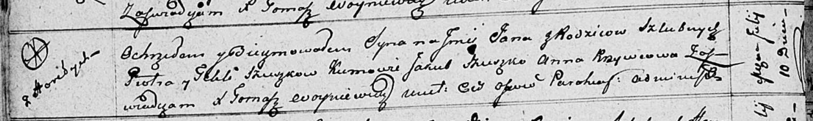

**Сушко Ян Пятрусёв (Suszko Jan)**

10 июля 1811 г -- крещение (НИАБ 136-13-894, лист 81об, №35/1811-р
(ориг)).

**НИАБ 136-13-894:** Лист 81об. **Метрическая запись №35/1811-р
(ориг).**

{width="6.496527777777778in"
height="0.9729035433070866in"}

Осовская Покровская церковь. 10 июля 1811 года. Метрическая запись о
крещении.

Szuszko Jan -- дочь родителей с деревни Горелое.

Szuszko Piotr -- отец.

Szuszkowa Tekla -- мать.

Szuszko Jakub -- кум.

Krzywcowa Anna -- кума.

Woyniewicz Tomasz -- ксёндз.
