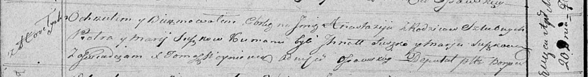

**Сушко Анастасия Петрова (Suszkowna Anastazija)**

20 апреля 1819 г -- крещение (НИАБ 136-13-894, лист 100об, №20/1819-р
(ориг)).

**НИАБ 136-13-894:** Лист 100об. **Метрическая запись №20/1819-р
(ориг).**

{width="6.496527777777778in"
height="0.8636111111111111in"}

Осовская Покровская церковь. 20 апреля 1819 года. Метрическая запись о
крещении.

Suszkowna Anastazija -- дочь родителей с деревни Горелое.

Suszko Piotr -- отец.

Suszkowa Marija -- мать.

Suszko Ihnat -- кум.

Suszkowa Marja -- кума.

Woyniewicz Tomasz -- ксёндз.
