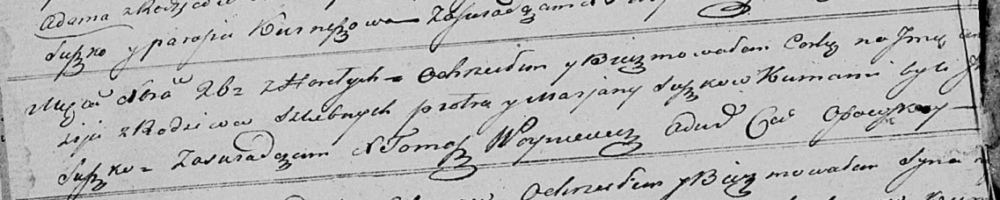

**Сушко Анастасия? Петрова младшая (Suszkowna Anastazija?)**

26 декабря 1821 г -- крещение (НИАБ 136-13-894, лист 107об, №55/1821-р
(ориг)).

**НИАБ 136-13-894:** Лист 107об. **Метрическая запись №55/1821-р
(ориг).**

{width="6.496527777777778in"
height="1.302791994750656in"}

Осовская Покровская церковь. 26 декабря 1821 года. Метрическая запись о
крещении.

Suszkowna Anastazija? -- дочь родителей с деревни Горелое.

Suszko Piotr -- отец.

Suszkowa Marjana -- мать.

Suszko J.. -- кум.

Woyniewicz Tomasz -- ксёндз.
