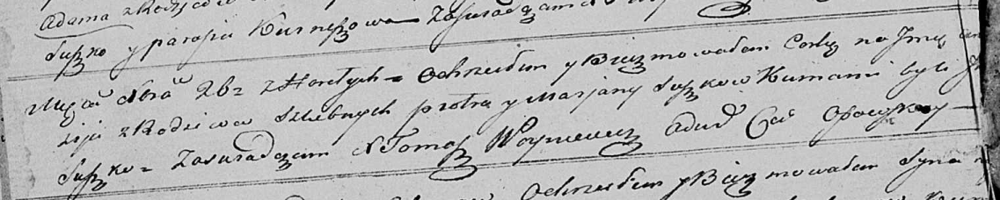

**Сушко Марыя (Suszko Marya, Marjana)**

7 февраля 1809 г -- крещение сына Адама (НИАБ 136-13-894, лист 73об,
№6/1809-р (ориг)).

20 апреля 1819 г -- крещение дочери Анастасии (НИАБ 136-13-894, лист
100об, №20/1819-р (ориг)).

26 декабря 1821 г -- крещение дочери Анастасии? младшей (НИАБ
136-13-894, лист 107об, №55/1821-р (ориг)).

**НИАБ 136-13-894:** Лист 73об. **Метрическая запись №6/1809-р (ориг).**

{width="6.496527777777778in"
height="1.7050951443569553in"}

Дедиловичская Покровская церковь. 7 февраля 1809 года. Метрическая
запись о крещении.

Suszko Adam -- сын родителей с деревни Горелое.

Suszko Piotr -- отец.

Suszkowa Marya -- мать.

Kuszniarewicz Adam -- кум, с деревни Дедиловичи.

Suszkowa Parasia -- кума, с деревни Горелое.

Jazgunowicz Antoni -- ксёндз.

**НИАБ 136-13-894:** Лист 100об. **Метрическая запись №20/1819-р
(ориг).**

{width="6.496527777777778in"
height="0.8636111111111111in"}

Осовская Покровская церковь. 20 апреля 1819 года. Метрическая запись о
крещении.

Suszkowna Anastazija -- дочь родителей с деревни Горелое.

Suszko Piotr -- отец.

Suszkowa Marija -- мать.

Suszko Ihnat -- кум.

Suszkowa Marja -- кума.

Woyniewicz Tomasz -- ксёндз.

**НИАБ 136-13-894:** Лист 107об. **Метрическая запись №55/1821-р
(ориг).**

{width="6.496527777777778in"
height="1.302791994750656in"}

Осовская Покровская церковь. 26 декабря 1821 года. Метрическая запись о
крещении.

Suszkowna Anastazija? -- дочь родителей с деревни Горелое.

Suszko Piotr -- отец.

Suszkowa Marjana -- мать.

Suszko J.. -- кум.

Woyniewicz Tomasz -- ксёндз.
