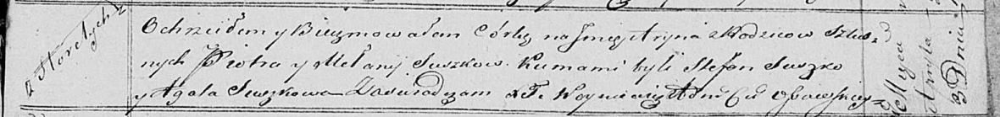

**Сушко Мелания (Suszkowa Mełanija)**

3 апреля 1821 г -- крещение дочери Арыны (НИАБ 136-13-894, лист 106,
№19/1821-р (ориг)).

**НИАБ 136-13-894:** Лист 106. **Метрическая запись №19/1821-р (ориг).**

Осовская Покровская церковь. 3 апреля 1821 года. Метрическая запись о
крещении.

Suszkowna Aryna -- дочь родителей с деревни Горелое.

Suszko Piotr -- отец.

Suszkowa Mełanija -- мать.

Suszko Stefan -- кум.

Suszkowa Agata -- кума.

Woyniewicz Tomasz -- ксёндз.
