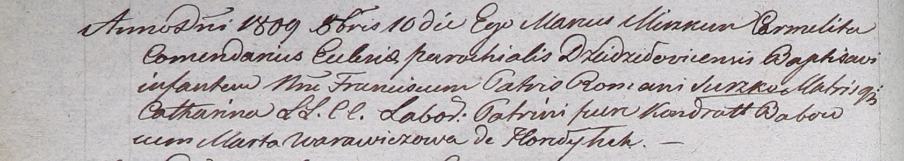

**Сушко Франциск Романов (Suszko Francisc)**

10 октября 1809 г -- крещение (НИАБ 937-4-32, лист 20об, №28/1809-р
(ориг)).

**НИАБ 937-4-32:** Лист 20об. **Метрическая запись №28/1809-р.**

{width="6.496527777777778in"
height="1.1583333333333334in"}

Дедиловичский костел Наисвятейшего Сердца Иисуса. 10 октября 1809 года.
Метрическая запись о крещении.

Suszko Francisc -- сын крестьян с деревни Горелое.

Suszko Roman -- отец.

Suszkowa Catharina -- мать.

Babowka Kondratt -- крестный отец.

Warawiczowa Marta -- крестная мать.

Miszkun Marcus -- ксёндз, комендант Дедиловичский.
