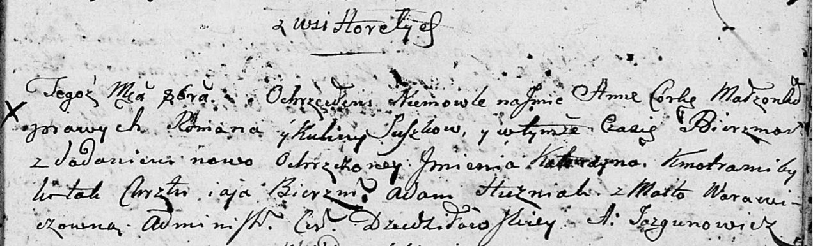

**Сушко Анна Романова (Suszkowna Anna)**

12 октября 1802 г -- крещение (НИАБ 136-13-894, лист 48, №37/1802-р
(ориг)).

**НИАБ 136-13-894:** Лист 48. **Метрическая запись №37/1802-р (ориг).**

Дедиловичская Покровская церковь. \[12\] октября 1802 года. Метрическая
запись о крещении.

Suszkowna Anna Katerzyna -- дочь Горелое.

Suszko Roman -- отец.

Suszkowa Kulina -- мать.

Huzniak Adam -- кум.

Warawiczowna Marta -- кума.

Jazgunowicz Antoni -- ксёндз.
