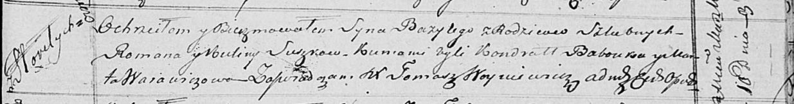

**Сушко Базыли Романов (Suszko Bazyli)**

10 марта 1818 г -- крещение (НИАБ 136-13-894, лист 98, №9/1818-р
(ориг)).

**НИАБ 136-13-894:** Лист 98. **Метрическая запись №9/1818-р (ориг).**

Осовская Покровская церковь. 10 марта 1818 года. Метрическая запись о
крещении.

Suszko Bazyli -- сын родителей с деревни Горелое.

Suszko Roman -- отец.

Suszkowa Kulina -- мать.

Babouko Kondrat -- кум.

Warawiczowa Marta -- кума.

Woyniewicz Tomasz -- ксёндз.
