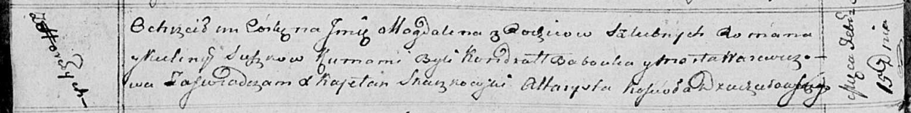

**Сушко Магдалена Романова (Suszkowna Magdalena)**

15 февраля 1814 г -- крещение (НИАБ 136-13-894, лист 88об, №11/1814-р
(ориг)).

**НИАБ 136-13-894:** Лист 88об. **Метрическая запись №11/1814-р
(ориг).**

{width="6.496527777777778in"
height="0.8146642607174103in"}

Осовская Покровская церковь. 15 февраля 1814 года. Метрическая запись о
крещении.

Suszkowna Magdalena -- дочь родителей с деревни Горелое.

Suszko Roman -- отец.

Suszkowa Kulina -- мать.

Babouka Kandrat -- кум.

Warawiczowa Marta -- кума.

Woyniewicz Tomasz -- ксёндз.
