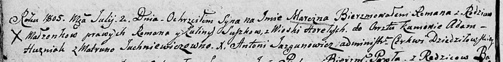

**Сушко Роман (Suszko Roman)**

13 ноября 1797 г -- венчание с Кулиной Кравчёнок (НИАБ 136-13-920, лист
5, №15/1797-б (ориг)).

12 октября 1802 г -- крещение дочери Анны Катерыны (НИАБ 136-13-894,
лист 48, №37/1802-р (ориг)).

2 июля 1805 г -- крещение сына Марцина Романа (НИАБ 136-13-894, лист
57об, №29/1805-р (ориг)).

4 марта 1807 г -- крестный отец Марьяны, дочери Сушков Якуба и Евдокии с
деревни Горелое (НИАБ 136-13-894, лист 62, №13/1807-р (ориг)).

15 февраля 1814 г -- крещение дочери Магдалены (НИАБ 136-13-894, лист
88об, №11/1814-р (ориг)).

10 марта 1818 г -- крещение сына Базылия (НИАБ 136-13-894, лист 98,
№9/1818-р (ориг)).

**НИАБ 136-13-920:** Лист 5. **Метрическая запись №15/1797-б (ориг).**

{width="6.496527777777778in"
height="0.8790332458442695in"}

Дедиловичская Покровская церковь. 13 ноября 1797 года. Метрическая
запись о венчании.

Suszko Roman -- жених с деревни \[Горелое\].

Krawcząkowa Kulina -- невеста.

Czaplay Chwiedor -- свидетель.

Apanowicz Maciey -- свидетель.

Jazgunowicz Antoni -- ксёндз.

**НИАБ 136-13-894:** Лист 48. **Метрическая запись №37/1802-р (ориг).**

{width="6.496527777777778in"
height="1.9732972440944883in"}

Дедиловичская Покровская церковь. \[12\] октября 1802 года. Метрическая
запись о крещении.

Suszkowna Anna Katerzyna -- дочь Горелое.

Suszko Roman -- отец.

Suszkowa Kulina -- мать.

Huzniak Adam -- кум.

Warawiczowna Marta -- кума.

Jazgunowicz Antoni -- ксёндз.

**НИАБ 136-13-894:** Лист 57об. **Метрическая запись №29/1805-р
(ориг).**

{width="6.496527777777778in"
height="0.8059470691163605in"}

Дедиловичская Покровская церковь. 2 июля 1805 года. Метрическая запись о
крещении.

Suszko Marcin Roman -- сын родителей с деревни Горелое.

Suszko Roman -- отец.

Suszkowa Kulina -- мать.

Huzniak Adam -- кум.

Juchniewiczowna Matruna -- кума.

Jazgunowicz Antoni -- ксёндз.

**НИАБ 136-13-894:** Лист 62. **Метрическая запись №13/1807-р (ориг).**

{width="6.496527777777778in"
height="0.9735739282589676in"}

Дедиловичская Покровская церковь. 4 марта 1807 года. Метрическая запись
о крещении.

Suszkowna Marjana -- дочь родителей с деревни Горелое.

Suszko Jakub -- отец.

Suszkowa Ewdokija -- мать.

Suszko Roman -- кум, с деревни Горелое.

Suszkowa Parasia -- кума, с деревни Горелое.

Jazgunowicz Antoni -- ксёндз.

**НИАБ 136-13-894:** Лист 88об. **Метрическая запись №11/1814-р
(ориг).**

{width="6.496527777777778in"
height="0.8146642607174103in"}

Осовская Покровская церковь. 15 февраля 1814 года. Метрическая запись о
крещении.

Suszkowna Magdalena -- дочь родителей с деревни Горелое.

Suszko Roman -- отец.

Suszkowa Kulina -- мать.

Babouka Kandrat -- кум.

Warawiczowa Marta -- кума.

Woyniewicz Tomasz -- ксёндз.

**НИАБ 136-13-894:** Лист 98. **Метрическая запись №9/1818-р (ориг).**

{width="6.496527777777778in"
height="0.8575765529308836in"}

Осовская Покровская церковь. 10 марта 1818 года. Метрическая запись о
крещении.

Suszko Bazyli -- сын родителей с деревни Горелое.

Suszko Roman -- отец.

Suszkowa Kulina -- мать.

Babouko Kondrat -- кум.

Warawiczowa Marta -- кума.

Woyniewicz Tomasz -- ксёндз.
