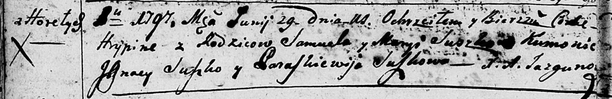
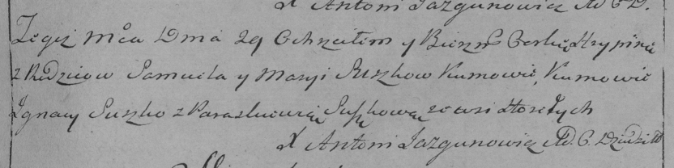

**Сушко Грыпина Самуэлева (Suszkowna Hrypina)**

29 июня 1797 г -- крещение (НИАБ 136-13-894, лист 33об, №41/1797-р
(ориг)), (РГИА 823-2-18, лист 260, №28/1797-р (коп)).

**НИАБ 136-13-894:** Лист 33об. **Метрическая запись №41/1797-р
(ориг).**

Дедиловичская Покровская церковь. 29 июня 1797 года. Метрическая запись
о крещении.

Suszkowna Hrypina -- дочь родителей с деревни Горелое.

Suszko Samuel -- отец.

Suszkowa Maryia -- мать.

Suszko Jgnacy - кум.

Suszkowa Paraskiewija - кума.

Jazgunowicz Antoni -- ксёндз.

**РГИА 823-2-18:** Лист 260. **Метрическая запись №28/1797-р (коп).**

Дедиловичская Покровская церковь. 29 июня 1797 года. Метрическая запись
о крещении.

Suszkowna Hrypina -- дочь родителей с деревни Горелое.

Suszko Samuel -- отец.

Suszkowa Marya -- мать.

Suszko Jgnacy -- кум.

Suszkowa Paraskiewia -- кума.

Jazgunowicz Antoni -- ксёндз.
