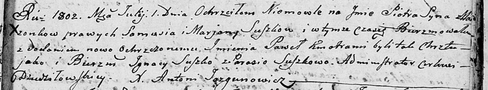

**Сушко Пётр Самуэлев (Suszko Piotr Paweł)**

1 июля 1802 г -- крещение (НИАБ 136-13-894, лист 47, №25/1802-р (ориг)).

**НИАБ 136-13-894:** Лист 47. **Метрическая запись №25/1802-р (ориг).**

Дедиловичская Покровская церковь. 1 июля 1802 года. Метрическая запись о
крещении.

Suszko Piotr Paweł -- сын родителей \[с деревни Горелое\].

Suszko Samuś -- отец.

Suszkowa Marjana -- мать.

Suszko Jgnacy-- кум.

Suszkowa Parasia -- кума.

Jazgunowicz Antoni -- ксёндз.
