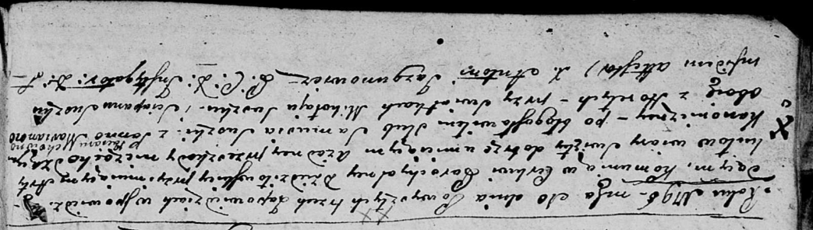
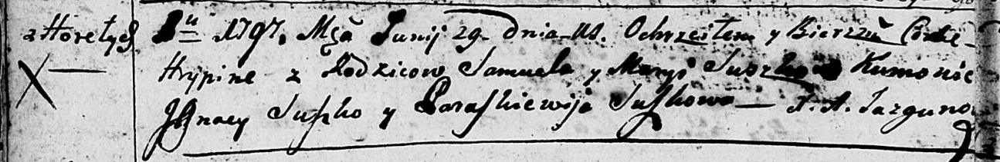
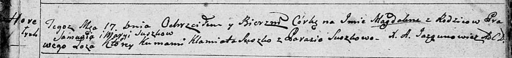
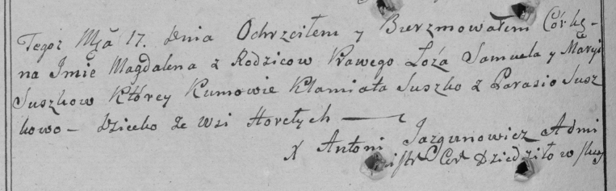
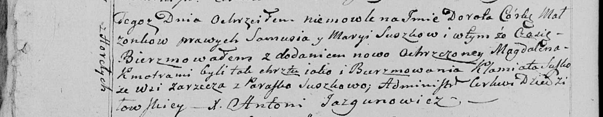
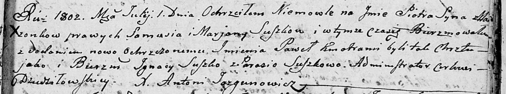
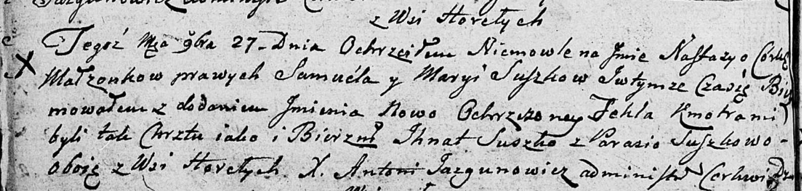
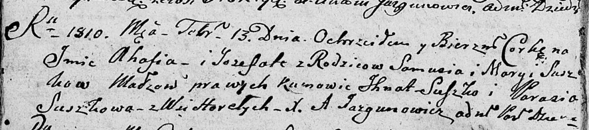
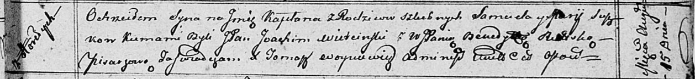
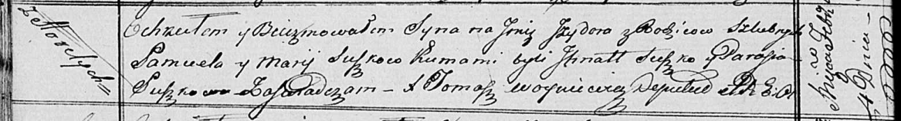

**Сушко Самуэль (Suszko Samuel, Samuś)**

10 февраля 1796 г -- венчание с Марьяной Потерухой с деревни Горелое
(НИАБ 136-13-920, лист 2об, №3/1796-б (ориг)).

29 июня 1797 г -- крещение дочери Грыпины (НИАБ 136-13-894, лист 33об,
№41/1797-р (ориг)), (РГИА 823-2-18, лист 260, №28/1797-р (коп)).

17 июля 1799 г -- крещение дочери Магдалены (НИАБ 136-13-894, лист 39,
№29/1799-р (ориг), РГИА 823-2-18, лист 270об, №28/1799-р (коп), НИАБ
136-13-938, лист 242об, №27/1799-р (коп)).

1 июля 1802 г -- крещение сына Петра Павла (НИАБ 136-13-894, лист 47,
№25/1802-р (ориг)).

27 ноября 1804 г -- крещение дочери Настасьи Текли (НИАБ 136-13-894,
лист 55об, №56/1804-р (ориг)).

13 февраля 1810 г -- крещение дочери Агафии Ёзефаты (НИАБ 136-13-894,
лист 76об, №8/1810-р (ориг)).

15 августа 1812 г -- крещение сына Каэтана (НИАБ 136-13-894, лист 85,
№42/1812-р (ориг)).

4 февраля 1817 г -- крещение сына Изыдора (НИАБ 136-13-894, лист 95об,
№9/1817-р (ориг)).

**НИАБ 136-13-920:** Лист 2об. **Метрическая запись №3/1796-б (ориг).**

Дедиловичская Покровская церковь. 10 февраля 1796 года. Метрическая
запись о венчании.

Suszko Samuś -- жених, деревня Горелое.

Paciaruchowna Marianna -- невеста, деревня Горелое.

Suszko Mikołay -- свидетель.

Suszko Sciapan -- свидетель.

Jazgunowicz Antoni -- ксёндз.

**НИАБ 136-13-894:** Лист 33об. **Метрическая запись №41/1797-р
(ориг).**

Дедиловичская Покровская церковь. 29 июня 1797 года. Метрическая запись
о крещении.

Suszkowna Hrypina -- дочь родителей с деревни Горелое.

Suszko Samuel -- отец.

Suszkowa Maryia -- мать.

Suszko Jgnacy - кум.

Suszkowa Paraskiewija - кума.

Jazgunowicz Antoni -- ксёндз.

**РГИА 823-2-18:** Лист 260. **Метрическая запись №28/1797-р (коп).**

Дедиловичская Покровская церковь. 29 июня 1797 года. Метрическая запись
о крещении.

Suszkowna Hrypina -- дочь родителей с деревни Горелое.

Suszko Samuel -- отец.

Suszkowa Marya -- мать.

Suszko Jgnacy -- кум.

Suszkowa Paraskiewia -- кума.

Jazgunowicz Antoni -- ксёндз.

**НИАБ 136-13-894:** Лист 39. **Метрическая запись №29/1799-р (ориг).**

Дедиловичская Покровская церковь. 17 июля 1799 года. Метрическая запись
о крещении.

Suszkowna Magdalena -- дочь родителей с деревни Горелое.

Suszko Samuś -- отец.

Suszkowa Maryja -- мать.

Suszko Klamiata -- кум.

Suszkowa Parasia -- кума.

Jazgunowicz Antoni -- ксёндз.

**РГИА 823-2-18:** Лист 270об. **Метрическая запись №28/1799-р (коп).**

Дедиловичская Покровская церковь. 17 июля 1799 года. Метрическая запись
о крещении.

Suszkowna Magdalena -- дочь родителей с деревни Горелое.

Suszko Samuel -- отец.

Suszkowa Maryia -- мать.

Suszko Klamiata -- кум.

Suszkowa Parasia -- кума.

Jazgunowicz Antoni -- ксёндз.

**НИАБ 136-13-938:** Лист 242об. **Метрическая запись №27/1799-р
(коп).**

(См. тж. НИАБ 136-13-894, лист 39, №29/1799-р (ориг); РГИА 823-2-18,
лист 270об, №28/1799-р (коп))

Дедиловичская Покровская церковь. 10 июля 1799 года. Метрическая запись
о крещении.

Suszkowna Dorota Magdalena -- дочь родителей с деревни Горелое.

Suszko Samuś -- отец.

Suszkowa Marya -- мать.

Suszko Klamiata -- кум, с деревни Заречье.

Suszkowa Paraska - кума.

Jazgunowicz Antoni -- ксёндз.

**НИАБ 136-13-894:** Лист 47. **Метрическая запись №25/1802-р (ориг).**

Дедиловичская Покровская церковь. 1 июля 1802 года. Метрическая запись о
крещении.

Suszko Piotr Paweł -- сын родителей \[с деревни Горелое\].

Suszko Samuś -- отец.

Suszkowa Marjana -- мать.

Suszko Jgnacy-- кум.

Suszkowa Parasia -- кума.

Jazgunowicz Antoni -- ксёндз.

**НИАБ 136-13-894:** Лист 55об. **Метрическая запись №56/1804-р
(ориг).**

Дедиловичская Покровская церковь. 27 ноября 1804 года. Метрическая
запись о крещении.

Suszkowna Nastazya Tekla -- дочь родителей с деревни Горелое.

Suszko Samuel -- отец.

Suszkowa Maryia -- мать.

Suszko Jhnat -- кум, с деревни Горелое.

Suszkowa Parasia -- кума, с деревни Горелое.

Jazgunowicz Antoni -- ксёндз.

**НИАБ 136-13-894:** Лист 76об. **Метрическая запись №8/1810-р (ориг).**

Дедиловичская Покровская церковь. 13 февраля 1810 года. Метрическая
запись о крещении.

Suszkowna Ahafia Jozefata -- дочь родителей из деревни Горелое.

Suszko Samuś -- отец.

Suszkowa Marya -- мать.

Suszko Jhnat -- кум.

Suszkowa Parasia -- кума.

Jazgunowicz Antoni -- ксёндз.

**НИАБ 136-13-894:** Лист 85. **Метрическая запись №42/1812-р (ориг).**

Осовская Покровская церковь. 15 августа 1812 года. Метрическая запись о
крещении.

Suszko Kaetan -- сын родителей с деревни Горелое.

Suszko Samuel -- отец.

Suszkowa Marija -- мать.

Wietcinski Joahim, JP -- кум, шляхтич.

B\...ska Benedykta, JP -- кума,шляхтянка.

Woyniewicz Tomasz -- ксёндз.

**НИАБ 136-13-894:** Лист 95об. **Метрическая запись №9/1817-р (ориг).**

Осовская Покровская церковь. 4 февраля 1817 года. Метрическая запись о
крещении.

Suszko Jzydor -- сын родителей с деревни Горелое.

Suszko Samuel -- отец.

Suszkowa Marija -- мать.

Suszko Jhnat -- кум.

Suszkowa Parasia -- кума.

Woyniewicz Tomasz -- ксёндз.
