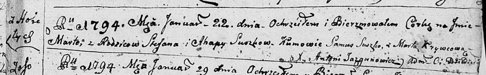

**Сушко Марта Степанова (Suszkowna Marta)**

22 января 1794 г -- крещение (НИАБ 136-13-894, лист 21, №5/1794-р
(ориг)).

**НИАБ 136-13-894:** Лист 21. **Метрическая запись №5/1794-р (ориг).**

Дедиловичская Покровская церковь. 22 января 1794 года. Метрическая
запись о крещении.

Suszkowna Marta -- дочь родителей с деревни Горелое.

Suszko Stefan -- отец.

Suszkowa Ahapa-- мать.

Suszko Samuś - кум.

Krywcowa Marta - кума.

Jazgunowicz Antoni -- ксёндз.
