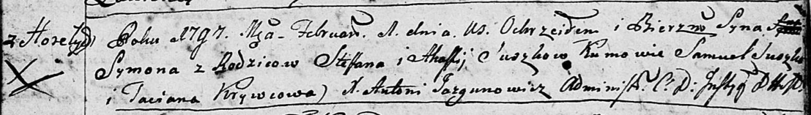

**Сушко Сымон Степанов (Suszko Symon)**

1 февраля 1797 г -- крещение (НИАБ 136-13-894, лист 32, №10/1797-р
(ориг)), (РГИА 823-2-18, лист 259, №9/1797-р (коп)).

**НИАБ 136-13-894:** Лист 32. **Метрическая запись №10/1797-р (ориг).**

Дедиловичская Покровская церковь. 1 февраля 1797 года. Метрическая
запись о крещении.

Suszko Symon -- сын родителей с деревни Горелое.

Suszko Stefan -- отец.

Suszkowa Ahafija -- мать.

Suszko Samuel - кум.

Krywcowa Taciana - кума.

Jazgunowicz Antoni -- ксёндз.

**РГИА 823-2-18:** Лист 259. **Метрическая запись №9/1797-р (коп).**

Дедиловичская Покровская церковь. 1 февраля 1797 года. Метрическая
запись о крещении.

Suszko Symon -- сын родителей с деревни Горелое.

Suszko Stefan -- отец.

Suszkowa Ahafija -- мать.

Suszko Samuel -- кум.

Krywcowa Tacianna -- кума.

Jazgunowicz Antoni -- ксёндз.
