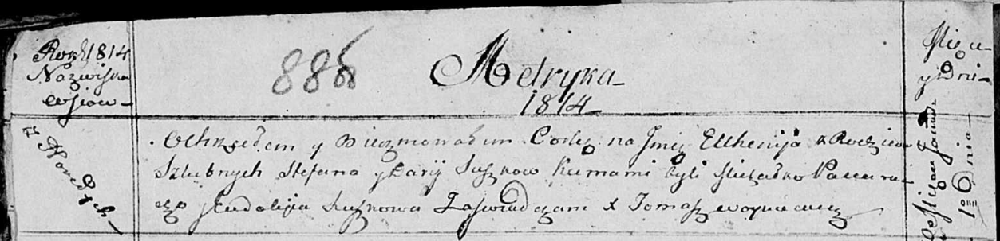

**Сушко Степан (Suszko Stefan)**

1 января 1814 г -- крещение дочери Евгении (НИАБ 136-13-894, лист 88об,
№1/1814-р (ориг)).

**НИАБ 136-13-894:** Лист 88об. **Метрическая запись №1/1814-р (ориг).**

Осовская Покровская церковь. 1 января 1814 года. Метрическая запись о
крещении.

Suszkowna Euhenija -- дочь родителей с деревни Горелое.

Suszko Stefan -- отец.

Suszkowa Darija -- мать.

Paciarucha Michałko -- кум.

Suszkowa Eudokija -- кума.

Woyniewicz Tomasz -- ксёндз.
