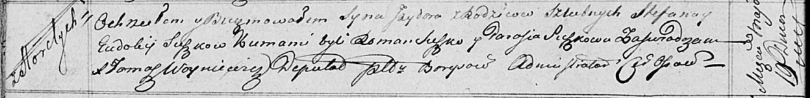

**Сушко Евдокия (Suszkowa Ewdokija)**

19 мая 1817 г -- крещение сына Изыдора (НИАБ 136-13-894, лист 96об,
№35/1817-р (ориг)).

**НИАБ 136-13-894:** Лист 96об. **Метрическая запись №35/1817-р
(ориг).**

{width="6.496527777777778in"
height="0.7918667979002625in"}

Осовская Покровская церковь. 19 мая 1817 года. Метрическая запись о
крещении.

Suszko Jzydor -- сын родителей с деревни Горелое.

Suszko Stefan -- отец.

Suszkowa Eudokija -- мать.

Suszko Roman -- кум.

Suszkowa Parasia -- кума.

Woyniewicz Tomasz -- ксёндз.
