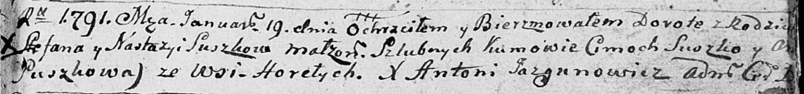
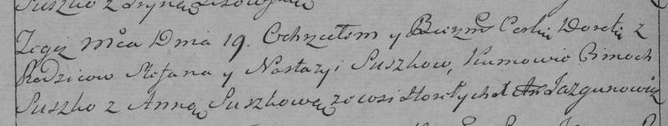

**Сушко Дорота Степанова (Suszkowna Dorota)**

16 января 1791 г -- крещение (НИАБ 136-13-894, лист 12, №2/1791-р
(коп)), (РГИА 823-2-18, лист 241об, №2/1791-р (коп)).

**НИАБ 136-13-894:** Лист 12. **Метрическая запись №2/1791-р (ориг).**

Дедиловичская Покровская церковь. 19 января 1791 года. Метрическая
запись о крещении.

Suszkowna Dorota -- дочь родителей с деревни Горелое.

Suszko Stefan -- отец.

Suszkowa Nastazya -- мать.

Suszko Cimoch - кум.

Suszkowa A? - кума.

Jazgunowicz Antoni -- ксёндз.

**РГИА 823-2-18:** Лист 241об. **Метрическая запись №2/1791-р (коп).**

Дедиловичская Покровская церковь. 19 января 1791 года. Метрическая
запись о крещении.

Suszkowna Dorota -- дочь родителей с деревни Горелое.

Suszko Stefan -- отец.

Suszkowa Nastazya -- мать.

Suszko Cimoch -- кум.

Suszkowa Anna - кума.

Jazgunowicz Antoni -- ксёндз.
