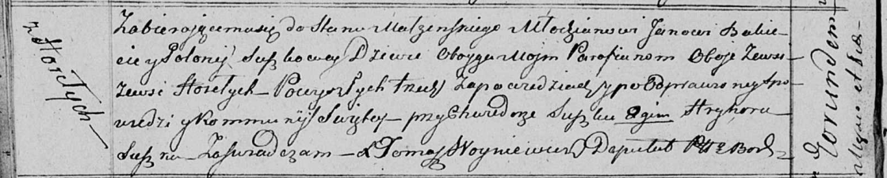

**Бокет (Сушко) Полония (Bokietowa Połonija z Suszkow)**

10 ноября 1818 г -- венчание с молодым Яном Бокетом с деревни Горелое
(НИАБ 136-13-920, лист 25об, №9/1818-б (ориг)).

**НИАБ 136-13-920:** Лист 25об. **Метрическая запись №9/1818-б (ориг).**

Осовская Покровская церковь. 10 ноября 1818 года. Запись о венчании.

Bakiet Jan -- жених, молодой, парафии Осовской, с деревни Горелое.

Suszkowna Połonija -- невеста, девка, парафии Осовской, с деревни
Горелое.

Suszko Chwiedor -- свидетель.

Suszko Hryhor -- свидетель.

Woyniewicz Tomasz -- ксёндз.
