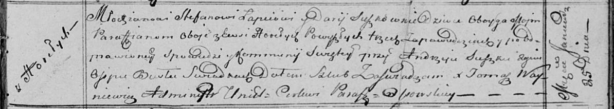

**Лапец (в девичестве Сушко) Дария (Lapciowa Darija z Suszkow)**

25 января 1814 г -- венчание с молодым Стефаном Лапецом с деревни
Горелое (НИАБ 136-13-920, лист 21, №2/1814-б (ориг)).

**НИАБ 136-13-920:** Лист 21. **Метрическая запись №2/1814-б (ориг).**

Осовская Покровская церковь. 25 января 1814 года. Запись о венчании.

Łapać Stefan -- жених, молодой, парафии Осовской, с деревни Горелое.

Suszkowna Darija -- невеста, девка, парафии Осовской, с деревни Горелое.

Suszko Andrzej -- свидетель.

Busła Osip -- свидетель.

Woyniewicz Tomasz -- ксёндз.
