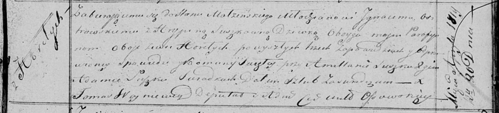

**Островская (в девичестве Сушко) Грыпина (Ostrowska Hrypina z
Suszkow)**

20 апреля 1819 г -- венчание с молодым Игнатом Островским с деревни
Горелое (НИАБ 136-13-920, лист 26, №5/1819-б (ориг)).

**НИАБ 136-13-920:** Лист 26. **Метрическая запись №5/1819-б (ориг).**

Осовская Покровская церковь. 20 апреля 1819 года. Запись о венчании.

Ostrowski Jgnacy -- жених, молодой, парафии Осовской, с деревни Горелое.

Suszkowna Hrypina -- невеста, девка, парафии Осовской, с деревни
Горелое.

Suszko Amellan -- свидетель.

Suszko Adam -- свидетель.

Woyniewicz Tomasz -- ксёндз.
