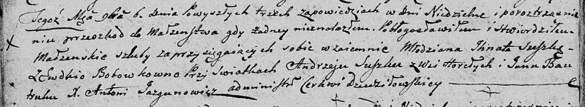

**Сушко Андрей (Suszko Andrzey)**

6 ноября 1804 г -- свидетель венчания молодого Игната Сушко с деревни
Горелое с Евдокией Бобовко (НИАБ 136-13-920, лист 10об, №8/1804-б
(ориг)).

**НИАБ 136-13-920:** Лист 10об. **Метрическая запись №8/1804-б (ориг).**

Дедиловичская Покровская церковь. 6 ноября 1804 года. Метрическая запись
о венчании.

Suszko Jhnat -- жених, молодой, с деревни \[Горелое\].

Bobowkowna Ewdokia -- невеста.

Suszko Andrzey -- свидетель, с деревни Горелое.

Bautruk Jan -- свидетель.

Jazgunowicz Antoni -- ксёндз.
