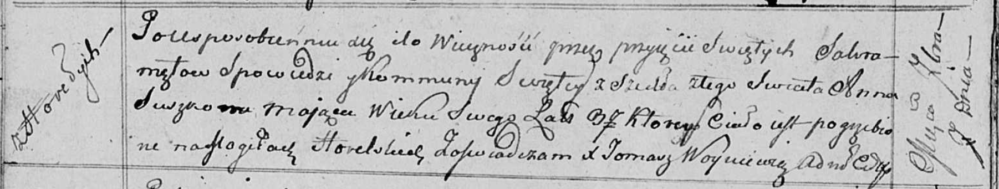

**Сушко Андрей (Suszko Аndrzey)**

11 ноября 1795 г -- свидетель венчания Степана Скакуна с деревни
Замосточье с Мартой Сушко с деревни Замосточье (НИАБ 136-13-920, лист
2об, №9/1795-б (ориг)).

**НИАБ 136-13-920:** Лист 2об. **Метрическая запись №9/1795-б (ориг).**

{width="6.496527777777778in"
height="1.3094969378827646in"}

Дедиловичская Покровская церковь. 11 ноября 1795 года. Метрическая
запись о венчании.

Skakun Stefan -- жених, деревня Замосточье.

Suszkowna Marta -- невеста, деревня Замосточье.

Busła Wasil -- свидетель, деревня Замосточье.

Suszko Andrzey -- свидетель, деревня Горелое.

Jazgunowicz Antoni -- ксёндз.
