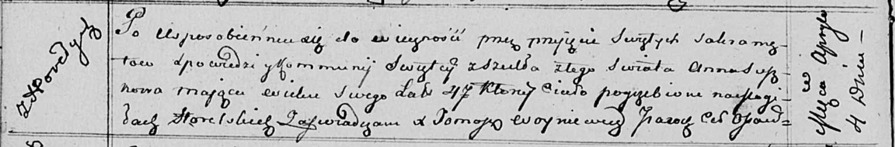

**Сушко Анна (Suszkowa Anna)**

4 апреля 1813 г -- отпевание, умерла в возрасте 47 лет (родилась около
1766 г) (НИАБ 136-13-919, лист 26об, №32/1813-у (ориг)).

**НИАБ 136-13-919:** Лист 26об. **Метрическая запись №32/1813-у
(ориг).**

Осовская униатская церковь. 4 апреля 1813 года. Метрическая запись об
отпевании.

Suszkowa Anna -- умершая, 47 лет, с деревни Горелое, похоронена на
кладбище деревни Горелое.

Woyniewicz Tomasz -- ксёндз.
