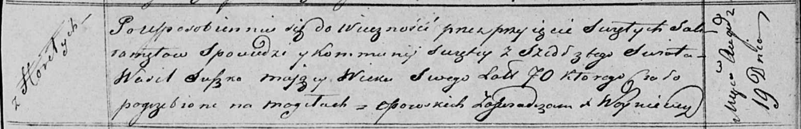

**Сушко Василь (Suszko Wasil)**

19 августа 1820 г -- отпевание, умер в возрасте 70 лет (родился около
1750 г) (НИАБ 136-13-919, лист 34, №17/1820-у (ориг)).

**НИАБ 136-13-919:** Лист 34. **Метрическая запись №17/1820-у (ориг).**

Осовская униатская церковь. 19 августа 1820 года. Метрическая запись об
отпевании.

Suszko Wasil -- умерший, 70 лет, с деревни Горелое, похоронен на
кладбище деревни Осово.

Woyniewicz Tomasz -- ксёндз.
