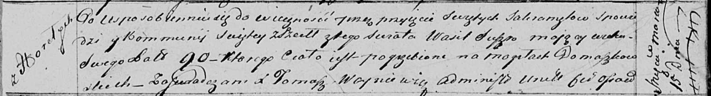

**Сушко Василь (Szuszko Wasil)**

15 марта 1817 г -- отпевание, умер в возрасте 90 лет (родился около 1727
г) (НИАБ 136-13-919, лист 30, №3/1817-у (ориг)).

**НИАБ 136-13-919:** Лист 30. **Метрическая запись №3/1817-у (ориг).**

Осовская униатская церковь. 15 марта 1817 года. Метрическая запись об
отпевании.

Suszko Wasil -- умерший, 90 лет, с деревни Горелое, похоронен на
кладбище деревни Домашковичи.

Woyniewicz Tomasz -- ксёндз.
