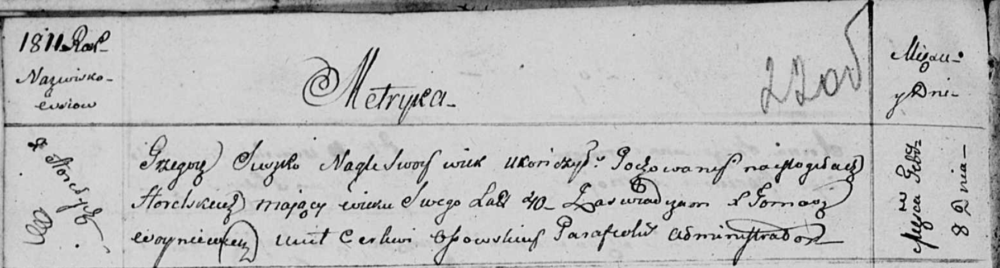

**Сушко Грыгор (Szuszko Grzegorz)**

8 февраля 1811 г -- отпевание, умер внезапно в возрасте 40 лет (родился
около 1771 г) (НИАБ 136-13-919, лист 22об, №5/1811-у (ориг)).

**НИАБ 136-13-919:** Лист 22об. **Метрическая запись №5/1811-у (ориг).**

Осовская униатская церковь. 8 февраля 1811 года. Метрическая запись об
отпевании.

Szuszko Grzegorz -- умер внезапно, 40 лет, с деревни Горелое, похоронен
на кладбище деревни Горелое.

Woyniewicz Tomasz -- ксёндз.
