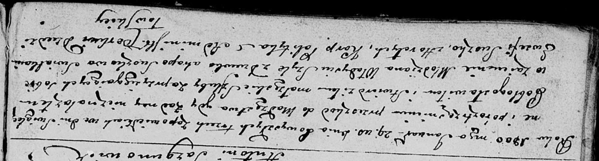
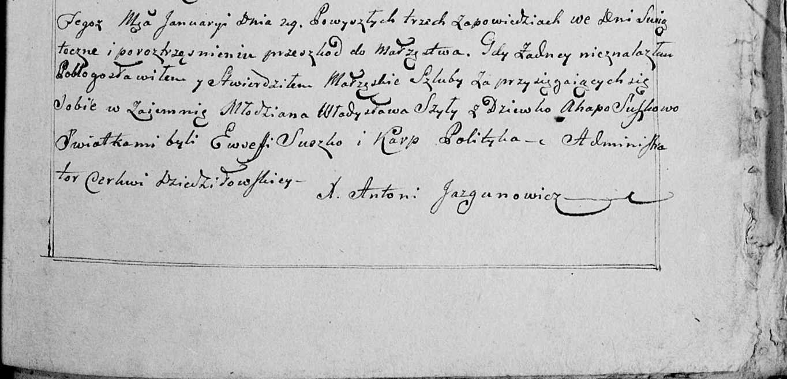

**Сушко Евсей (Suszko Ewsefi)**

29 января 1800 г -- свидетель венчания молодого Владыся Шило с девкой
Агапой Сушко (НИАБ 136-13-920, лист 6об, №3/1800-б (ориг), НИАБ
136-13-949, лист 107, №3/1800-б (коп)).

**НИАБ 136-13-920:** Лист 6об. **Метрическая запись №3/1800-б (ориг).**

Дедиловичская Покровская церковь. 29 января 1800 года. Метрическая
запись о венчании.

Szyło Władyś -- жених, молодой.

Suszkowa Ahapa -- невеста, девка.

Suszko Ewsefi -- свидетель, деревня Горелое.

Polityka Karp -- свидетель.

Jazgunowicz Antoni -- ксёндз.

**НИАБ 136-13-949:** Лист 107. **Метрическая запись №3/1800-б (коп).**

(См. тж.: НИАБ 136-13-920, лист 6об, №3/1800-б (ориг))

Дедиловичская Покровская церковь. 29 января 1800 года. Метрическая
запись о венчании.

Szyło Władysław -- жених, молодой.

Suszkowa Ahapa -- невеста, девка.

Suszko Ewsefi -- свидетель с деревни \[Горелое\].

Polytyka Karp -- свидетель.

Jazgunowicz Antoni -- ксёндз.
