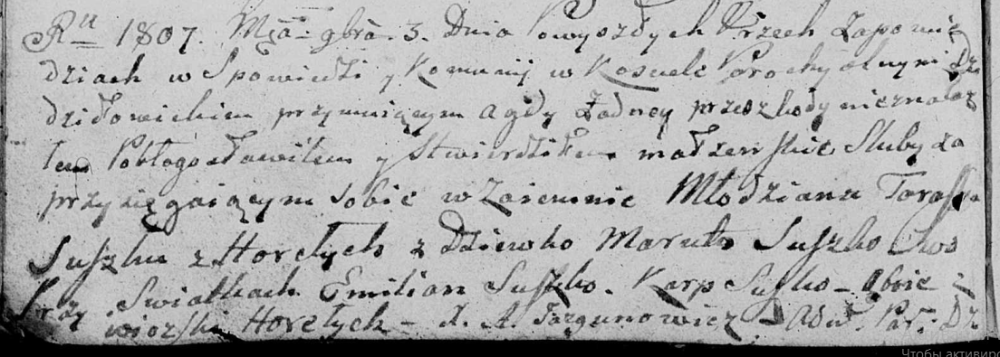

**Сушко Емельян (Suszko Emilian)**

3 ноября 1807 г -- свидетель венчания молодого Тараса Сушко с деревни
Горелое с девкой Марутой Сушко (НИАБ 136-13-920, лист 12об, №8/1807-б
(ориг)).

**НИАБ 136-13-920:** Лист 12об. **Метрическая запись №8/1807-б (ориг).**

Дедиловичская Покровская церковь. 3 ноября 1807 года. Метрическая запись
о венчании.

Suszko Taras -- жених, молодой, с деревни Горелое.

Suszko Maruta -- невеста, девка.

Suszko Emilian -- свидетель, с деревни Горелое.

Suszko Karp -- свидетель, с деревни Горелое.

Jazgunowicz Antoni -- ксёндз.
