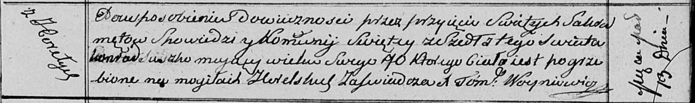

**Сушко Конрад (Suszko Konrad)**

13 марта 1813 г -- отпевание, умер в возрасте 70 лет (родился около 1743
г) (НИАБ 136-13-919, лист 26, №23/1813-у (ориг)).

**НИАБ 136-13-919:** Лист 26. **Метрическая запись №23/1813-у (ориг).**

Осовская униатская церковь. 13 марта 1813 года. Метрическая запись об
отпевании.

Suszko Konrad -- умерший, 70 лет, с деревни Горелое, похоронен на
кладбище деревни Горелое.

Woyniewicz Tomasz -- ксёндз.
