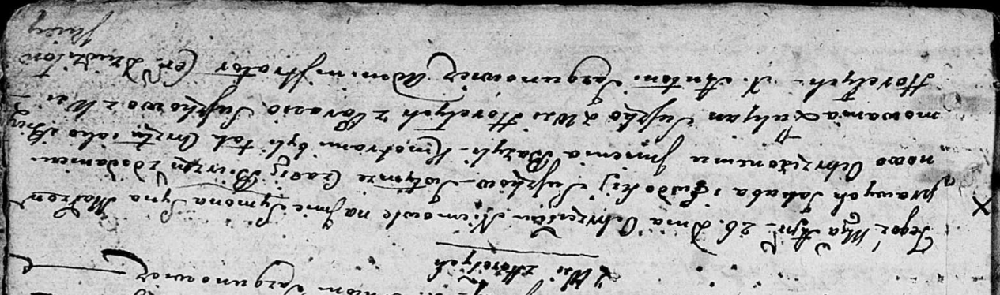

**Сушко Лукьян (Suszko Łukjan)**

15 марта 1803 г -- крестный отец Евы Магдалены, дочери Шумских Михала и
Маруты с деревни Заречье (НИАБ 136-13-894, лист 49об, №9/1803-р (об)).

7 апреля 1803 г -- крестный отец Базыля Антона, сына Чапляев Яна и
Грыпины с деревни Отруб (НИАБ 136-13-894, лист 50, №12/1803-р (об)).

26 апреля 1803 г -- крестный отец Сымона Базыля, сына Сушков Якуба и
Евдокии с деревни Горелое (НИАБ 136-13-894, лист 50, №16/1803-р (об)).

24 июля 1804 г -- крестный отец Сымона Фомы, сына Чапляев Яна и Грыпины
с деревни Отруб (НИАБ 136-13-894, лист 50, №12/1803-р (ориг)).

24 января 1809 г -- свидетель венчания Адама Сушко с деревни Горелое с
девкой Агапой Скакун с деревни Осово (НИАБ 136-13-920, лист 14об,
№1/1809-б (ориг)).

**НИАБ 136-13-894:** Лист 49об. **Метрическая запись №9/1803-р (ориг).**

{width="6.496527777777778in"
height="1.773487532808399in"}

Дедиловичская Покровская церковь. 15 февраля 1803 года. Метрическая
запись о крещении.

Szumska Ewa Magdalena -- дочь родителей с деревни Заречье.

Szumski Michał -- отец.

Szumska Marjana -- мать.

Suszko Łukjan -- кум, с деревни Горелое.

Kamisionkowa Fruzyna -- кума, с деревни Дедиловичи.

Jazgunowicz Antoni -- ксёндз.

**НИАБ 136-13-894:** Лист 50. **Метрическая запись №12/1803-р (ориг).**

{width="6.496527777777778in"
height="1.27463145231846in"}

Дедиловичская Покровская церковь. 7 апреля 1803 года. Метрическая запись
о крещении.

Czaplay Bazyli Antoni -- сын родителей с деревни Отруб.

Czaplay Jan -- отец.

Czaplaiowa Hrypina -- мать.

Suszko Łukjan -- кум, с деревни Горелое.

Suszkowa Magdalena -- кума, с деревни Отруб.

Jazgunowicz Antoni -- ксёндз.

**НИАБ 136-13-894:** Лист 50. **Метрическая запись №16/1803-р (ориг).**

{width="6.496527777777778in"
height="1.9209984689413824in"}

Дедиловичская Покровская церковь. 26 апреля 1803 года. Метрическая
запись о крещении.

Suszko Symon Bazyli -- сын родителей с деревни Горелое.

Suszko Jakub -- отец.

Suszkowa Ewdokija -- мать.

Suszko Łukjan -- кум, с деревни Горелое.

Suszkowa Parasia -- кума, с деревни Горелое.

Jazgunowicz Antoni -- ксёндз.

**НИАБ 136-13-894:** Лист 54. **Метрическая запись №25/1804-р (ориг).**

{width="6.496527777777778in"
height="1.7936023622047244in"}

Дедиловичская Покровская церковь. 24 июля 1804 года. Метрическая запись
о крещении.

Czaplay Symon Tomasz -- сын родителей с деревни Отруб.

Czaplay Januś -- отец.

Czaplaiowa Hrypina -- мать.

Suszko Łukian -- кум, с деревни Горелое.

Suszkowa Magdalena -- кума, с деревни Разлитье.

Jazgunowicz Antoni -- ксёндз.

**НИАБ 136-13-920:** Лист 14об. **Метрическая запись №1/1809-б (ориг).**

{width="6.496527777777778in"
height="2.097341426071741in"}

Дедиловичская Покровская церковь. 24 января 1809 года. Метрическая
запись о венчании.

Suszko Adam -- жених, с деревни Горелое.

Skakunowna Ahapa -- невеста, девка, с деревни Осовo.

Suszko Łukjan -- свидетель, с деревни Горелое.

Skakun Kuzma -- свидетель, с деревни Осовo.

Jazgunowicz Antoni -- ксёндз.
