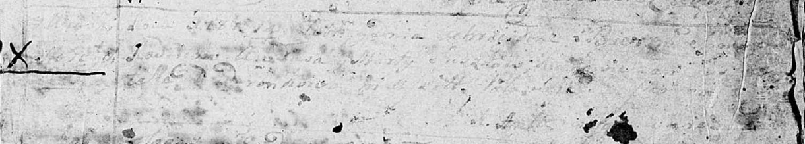

**Сушко Марта (Suszko Marta)**

1 января 1787 г -- крещение сына (НИАБ 136-13-894, лист 1, №2/1787-р
(ориг)).

**НИАБ 136-13-894:** Лист 1. **Метрическая запись №2/1787-р (ориг)**

Дедиловичская Покровская церковь. 1 января 1787 года. Метрическая запись
о крещении.

Suszko - сын родителей с деревни Горелое.

Suszko ? -- отец.

Suszkowa Marta -- мать.

Jazgunowicz Antoniusz -- ксёндз.
