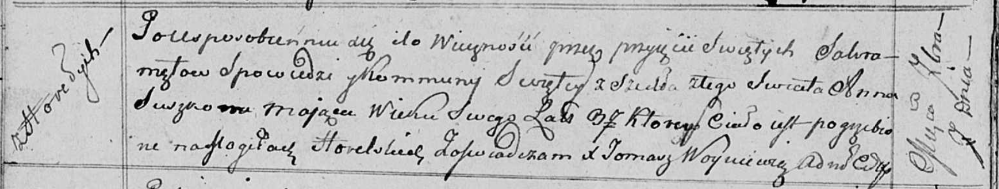

**Сушко Марьяна (Suszkowa Marjana)**

6 февраля 1809 г -- крестная мать Агафии, дочери Сушков Изыдора и Ульяны
с деревни Разлитье (НИАБ 136-13-894, лист 73об, №5/1809-р (ориг)).

**НИАБ 136-13-894:** Лист 73об. **Метрическая запись №5/1809-р (ориг).**

{width="6.496527777777778in"
height="1.3430227471566054in"}

Дедиловичская Покровская церковь. 6 февраля 1809 года. Метрическая
запись о крещении.

Suszkowna Ahafia -- дочь родителей с деревни Разлитье.

Suszko Jzydor -- отец.

Suszkowa Ullana -- мать.

Łapać Stefan -- кум, с деревни Горелое.

Suszkowa Marjana -- кума, с деревни Горелое.

Jazgunowicz Antoni -- ксёндз.
