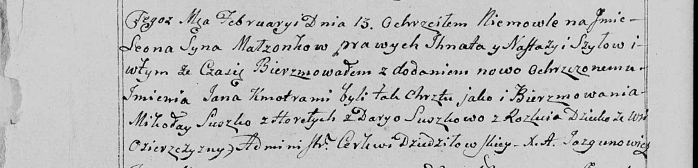
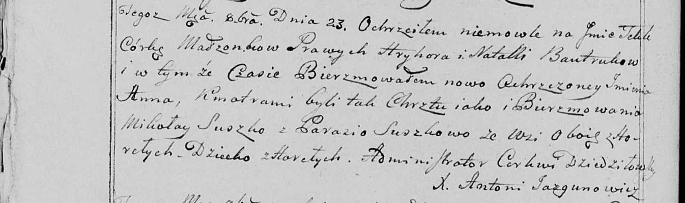

**Сушко Миколай (Suszko Mikołay)**

13 февраля 1799 г -- крестный отец у Леона Яна, сына Шил Игната и
Настасьи с деревни Озерщизна (НИАБ 136-13-938, лист 240об, №8/1799-р
(коп)).

23 октября 1799 г -- крестный отец Текли Анны, дочери Бавтруков Грыгора
и Натальи с деревни Нивки (НИАБ 136-13-938, лист 244об, №39/1799-р
(коп)).

**НИАБ 136-13-938:** Лист 240об. **Метрическая запись №8/1799-р (коп).**

(См. тж. НИАБ 136-13-894, лист 38, №8/1799-р (ориг); РГИА 823-2-18, лист
268об, №8/1799-р (коп))

Дедиловичская Покровская церковь. 13 февраля 1799 года. Метрическая
запись о крещении.

Szyło Leon Jan -- сын родителей с деревни Озерщизна.

Szyło Jgnat -- отец.

Szyłowa Nastazija -- мать.

Suszko Mikołay -- кум, с деревни Горелое.

Suszkowa Darya - кума, с деревни Разлитье.

Jazgunowicz Antoni -- ксёндз.

**НИАБ 136-13-938:** Лист 244об. **Метрическая запись №39/1799-р
(коп).**

(См. тж. НИАБ 136-13-894, лист 39об, №41/1799-р (ориг); РГИА 823-2-18,
лист 272об, №40/1799-р (коп))

Дедиловичская Покровская церковь. 23 октября 1799 года. Метрическая
запись о крещении.

Bautrukowna Tekla Anna -- дочь родителей с деревни \[Нивки\].

Bautruk Hryhor -- отец.

Bautrukowa Natalla -- мать.

Suszko Mikołay -- кум, с деревня Горелое.

Suszkowa Parasia - кума, с деревня Горелое.

Jazgunowicz Antoni -- ксёндз.
