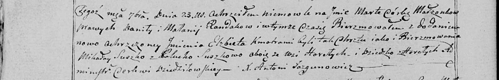

**Сушко Миколай (Suszko Mikołay)**

23 сентября 1800 г -- крестный отец Марты Эльжбеты, дочери Рандаков
Данилы и Маланьи с деревни Горелое (НИАБ 136-13-949, лист 103об,
№30/1800-р (коп)).

**НИАБ 136-13-949:** Лист 103об. **Метрическая запись №30/1800-р
(коп).**

(См. тж.: НИАБ 136-13-894, лист 42, №27/1800-р (ориг))

Дедиловичская Покровская церковь. 23 сентября 1800 года. Метрическая
запись о крещении.

Randakowna Marta Elżbieta -- дочь родителей с деревни Горелое.

Randak Daniła -- отец.

Randakowa Małania -- мать.

Suszko Mikołay -- кум, с деревни Горелое.

Suszkowa Palucha - кума, с деревни Горелое.

Jazgunowicz Antoni -- ксёндз.
