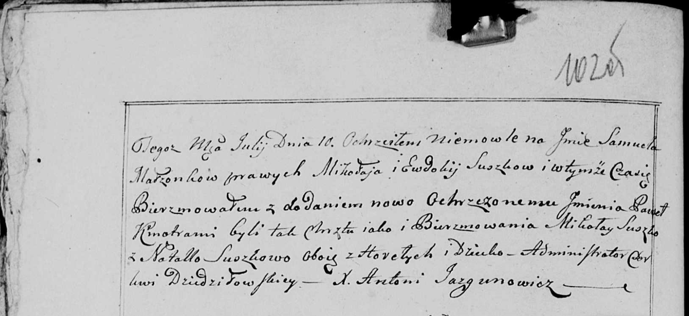

**Сушко Наталья (Suszkowa Natalla)**

10 июля 1800 г -- крестная мать Самуэля Павла, сына Сушков Миколая и
Евдокии с деревни Горелое (НИАБ 136-13-949, лист 102об, №17/1800-р
(коп)).

**НИАБ 136-13-949:** Лист 102об. **Метрическая запись №17/1800-р
(коп).**

(См. тж.: РГИА 823-2-18, лист 276, №15/1800-р (коп), НИАБ 136-13-894,
лист 41об, №16/1800-р (ориг))

Дедиловичская Покровская церковь. 10 июля 1800 года. Метрическая запись
о крещении.

Suszko Samuel Paweł -- сын родителей с деревни Горелое.

Suszko Mikołay -- отец.

Suszkowa Ewdokia -- мать.

Suszko Mikołay -- кум, с деревни Горелое.

Suszkowa Natalla - кума, с деревни Горелое.

Jazgunowicz Antoni -- ксёндз.
