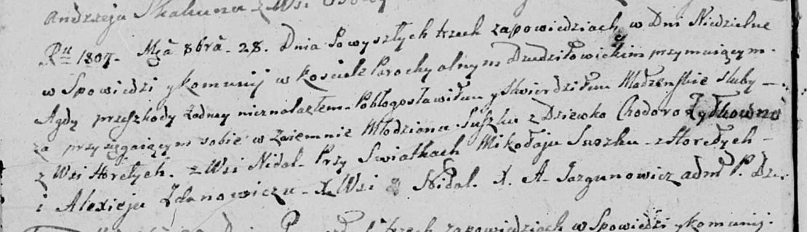

**Сушко Паланея (Suszkowa Pałanieja)**

9 апреля 1800 г -- крестная мать Грыгора Рафаля, сына Сушков Миколая и
Натальи с деревни Горелое (НИАБ 136-13-894, лист 41, №13/1800-р (ориг),
НИАБ 136-13-949, лист 102, №13/1800-р (коп)).

**НИАБ 136-13-894:** Лист 41. **Метрическая запись №13/1800-р (ориг).**

{width="6.496527777777778in"
height="1.3074857830271216in"}

Дедиловичская Покровская церковь. 9 апреля 1800 года. Метрическая запись
о крещении.

Suszko Grzegorz Rafal -- сын родителей \[с деревни Горелое\].

Suszko Mikołay -- отец.

Suszkowa Natalla -- мать.

Suszko Jakub -- кум, с деревни Горелое.

Suszkowa Pałanieja -- кума, с деревни Горелое.

Jazgunowicz Antoni -- ксёндз.

**НИАБ 136-13-949:** Лист 102. **Метрическая запись №13/1800-р (коп).**

(См. тж.: НИАБ 136-13-894, лист 41, №13/1800-р (ориг))

{width="6.496527777777778in"
height="1.3229166666666667in"}

Дедиловичская Покровская церковь. 12 апреля 1800 года. Метрическая
запись о крещении.

Suszko Hryhor Rafał -- сын родителей с деревни Горелое.

Suszko Mikołay -- отец.

Suszkowa Natalla -- мать.

Suszko Jakub -- кум, с деревни Горелое.

Suszkowa Pałanieja - кума, с деревни Горелое.

Jazgunowicz Antoni -- ксёндз.
