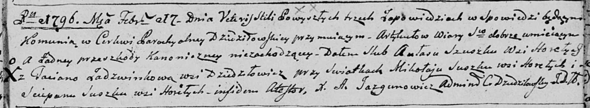

**Сушко Степан (Suszko Sciepan)**

17 февраля 1796 г -- свидетель венчания Авласа Сушко с деревни Горелое с
Татьяной Ядзвинко с деревни Дедиловичи (НИАБ 136-13-894, лист 3,
№8/1796-б (ориг)).

**НИАБ 136-13-920:** Лист 3. **Метрическая запись №8/1796-б (ориг).**

{width="6.496527777777778in"
height="1.1914884076990375in"}

Дедиловичская Покровская церковь. 17 февраля 1796 года. Метрическая
запись о венчании.

Szuszko Awłas -- жених, деревня Горелое.

Jadzwinkowa Taciana -- невеста, деревня Дедиловичи.

Suszko Mikołay -- свидетель, деревня Горелое.

Suszko Sciepan -- свидетель, деревня Горелое.

Jazgunowicz Antoni -- ксёндз.
