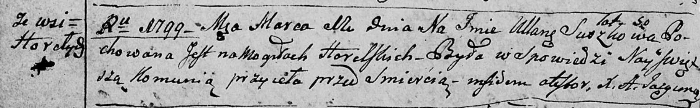
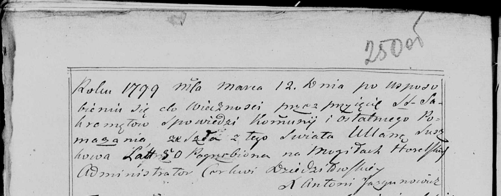

**Сушко Ульяна (Suszkowa Ullana)**

11 марта 1799 г -- отпевание, умерла в возрасте 50 лет (родилась около
1749 г) (НИАБ 136-13-919, лист 8об, №6/1799-у (ориг), НИАБ 136-13-938,
лист 250об, №6/1799-у (коп)).

**НИАБ 136-13-919:** Лист 8об. **Метрическая запись №6/1799-у (ориг).**

Дедиловичская Покровская церковь. 11 марта 1799 года. Метрическая запись
об отпевании.

Suszkowa Ullana -- умершая, 50 лет, с деревни Горелое, похоронена на
кладбище деревни Горелое.

Jazgunowicz Antoni -- ксёндз.

**НИАБ 136-13-938:** Лист 250об. **Метрическая запись №6/1799-у (коп).**

(См. тж. НИАБ 136-13-919, Лист 8об. Метрическая запись №6/1799-у (ориг))

Дедиловичская Покровская церковь. 12 марта 1799 года. Метрическая запись
об отпевании.

Suszkowa Ullana -- умершая, 50 лет, с деревни \[Горелое\], похоронена на
кладбище деревни Горелое.

Jazgunowicz Antoni -- ксёндз.
