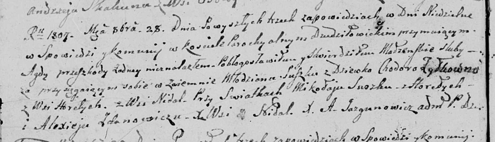

**Сушко Цимахвей (Suszko Cimachwiey)**

8 ноября 1799 г -- свидетель венчания Скакуна Сымона с деревни Осово с
Марией Скакун (НИАБ 136-13-893, лист 6об, №7/1799-б (ориг))

**НИАБ 136-13-938:** Лист 248об. **Метрическая запись №7/1799-б (коп).**

(См. тж. НИАБ 136-13-920, лист 6об, №7/1799-б (ориг))

{width="6.496527777777778in"
height="3.2159722222222222in"}

Дедиловичская Покровская церковь. 8 ноября 1799 года. Метрическая запись
о венчании.

Skakun Symon -- жених, молодой, с деревни \[Осово\].

Skakunowa Marya -- невеста.

Skakun Leon -- свидетель, с деревни Клинники.

Suszko Cimachwiey -- свидетель, с деревни Горелое.

Jazgunowicz Antoni -- ксёндз.
